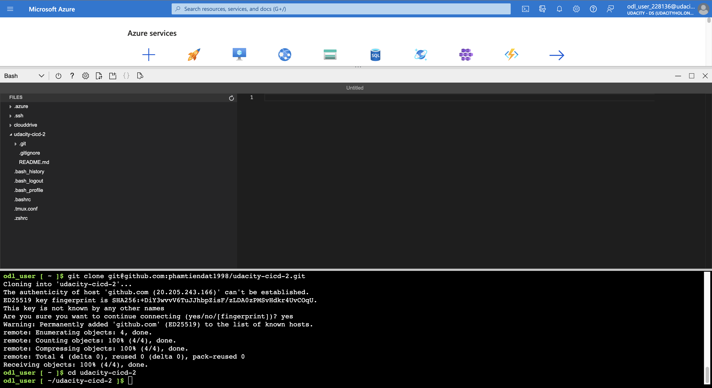
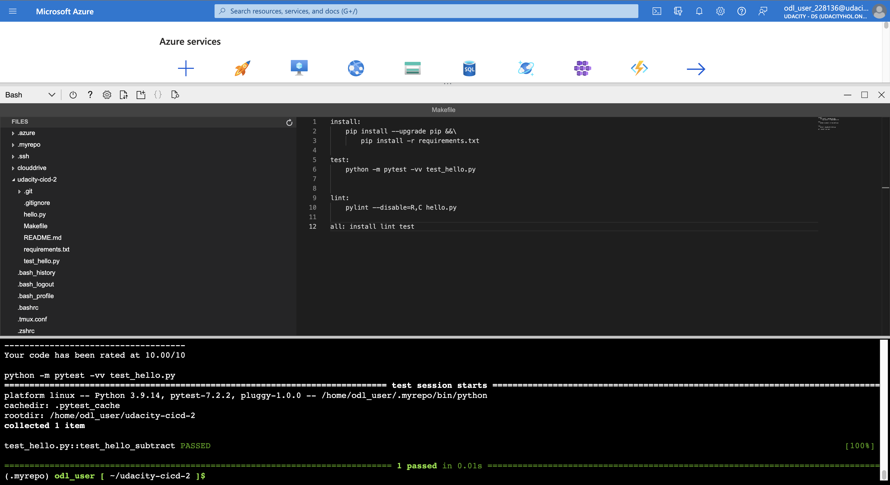
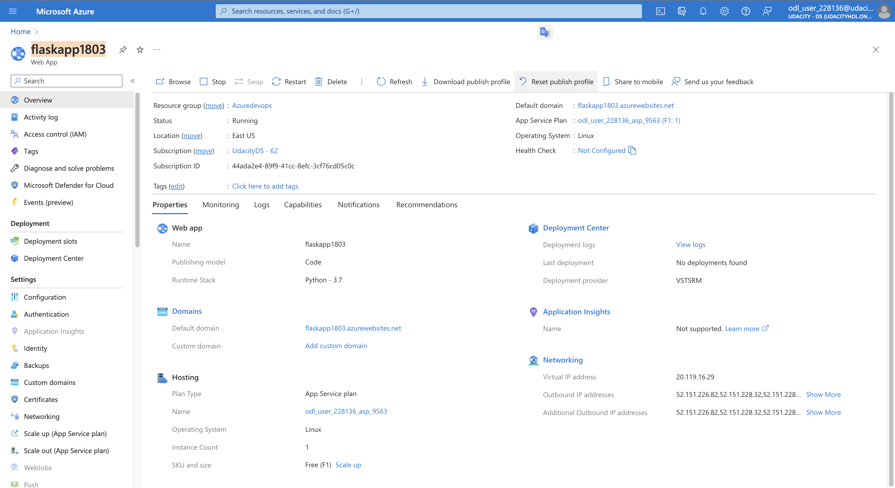
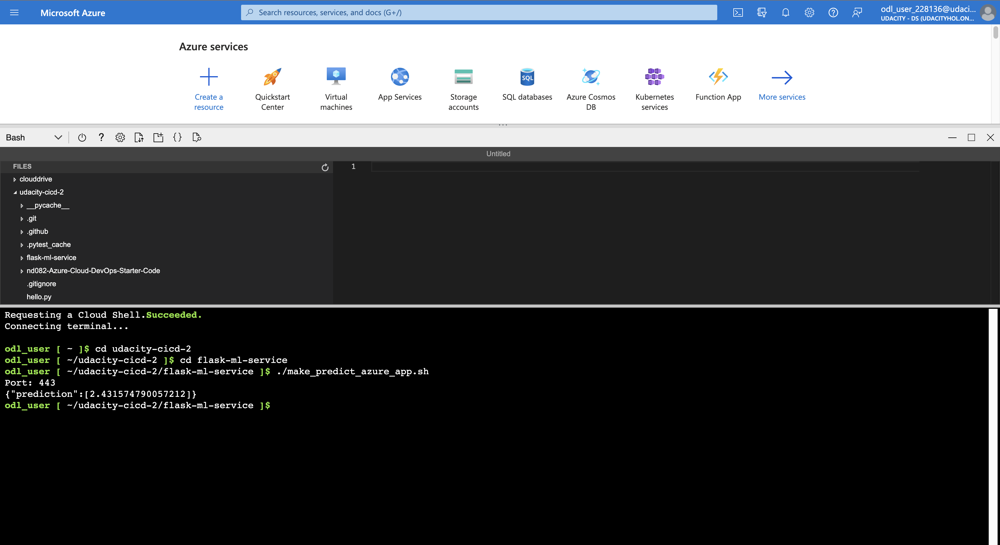

# Building a CI/CD Pipeline Project

### Introduction
In this project, you will build a Github repository from scratch and create a scaffolding that will assist you in performing both Continuous Integration and Continuous Delivery.
- Plan: https://docs.google.com/spreadsheets/d/17kJWnbzlmhgPtIybCxbJsRGX8g8DhDdbvSZ2rrNvfAo/edit?usp=sharing
- Trello: https://trello.com/invite/b/uxic8XoV/ATTIa2f551f71307af4383c32dfd6815a181EE358150/azure-devops-project-management

### Getting Started
1. Clone this repository

2. Create your infrastructure as code

3. Update this README to reflect how someone would use your code.

## Architectural Diagram

### Dependencies
1. Create an [Azure Account](https://portal.azure.com) 
2. Create an [Azure Devops](https://dev.azure.com/)
3. Create a reposistory in your GitHub account 
3. Create the Cloud-Based Development Environment: Launch an Azure Cloud Shell environment and create ssh-keys. Upload these keys to your GitHub account.

### Instructions
#### Hello app
1. Run a comment azure in cloud shell which will install, lint, and test code: <code>make all</code>.
#### Flask ML Service
1. Run pipeline in Azure Devops to deploy your web app.
2. Make a prediction: <code>./make_predict_azure_app.sh</code>.

### Output
Expected should be like the following after done your work:
1. Clone your repository.

2. The passing test after run <code>make all</code>.

3. GitHub actions badge

4. Azure Azure App Service

5. Prediction

6. Successful run of the project in Azure Pipelines

### Video  link
https://youtu.be/vyOPLK7icLk